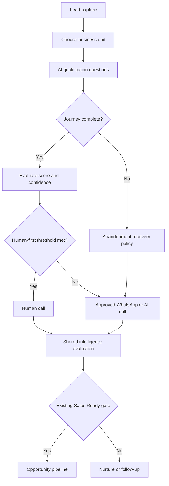

# Synaptech CRM + AI Funnel — Omnichannel Architecture

**Architecture version:** 2.0  
**Status:** Approved design baseline; provider execution remains disabled  
**Scope:** Synaptech Education admissions and Synaptech Solutions enquiries

## 1. Non-negotiable invariants

1. Existing website, LMS, Firebase, Supabase, lead-capture, Meta Pixel, scoring, qualification, Sales Ready, opportunity, pipeline, finance and post-sale logic remain unchanged.
2. WhatsApp, AI telecalling and human-call outcomes are evidence inputs. A channel never directly overwrites a score, qualification result, Sales Ready state or opportunity.
3. The existing shared scoring and qualification engines remain the only authorities that may recalculate intelligence.
4. Sales Ready and pipeline entry never wait for WhatsApp or AI telecalling when the existing validation, qualification and human-handoff gates have already passed.
5. A Won deal requires recorded human/commercial confirmation and the existing work-order/close-won workflow. A WhatsApp reply or AI-call outcome alone cannot close a deal.
6. Every query, mutation, job, event, template, usage record and alert remains organization-scoped.
7. No automated communication is sent without the required consent, approved template/session eligibility, quiet-hours check, attempt cap, opt-out/DND check and provider readiness.
8. Provider credentials remain server-side. Gupshup and telephony execution remain disabled until onboarding, webhook verification and controlled tests pass.

## 2. Current foundation confirmed in the project

The current project already contains:

- Provider-neutral `crm_communication_settings`, `crm_communication_jobs` and `crm_communication_events` integration.
- A communication-routing policy that prioritizes a human call for verified leads with score and confidence of at least 90.
- WhatsApp and AI-call consent checks, quiet hours, daily caps, monthly AI-call-minute cap and maximum attempts.
- Immutable routing and consent snapshots on queued communication jobs.
- Human-call activity capture and follow-up tasks.
- Engagement events for human, WhatsApp and AI-call outcomes.
- Contract usage metering with warning at 80% and critical alert at 100%.
- Provider-neutral CRM UI with both queues disabled.

## 3. Authoritative lead journey

Every channel writes evidence first. The shared engines then evaluate that evidence through the existing rules.

## 4. Business-unit selection

The first qualifying interaction must ask:

> Please select the service you are interested in:
>
> **1 — Synaptech Education: Admission / Enrolment**  
> **2 — Synaptech Solutions: CRM, LMS, Website and AI Funnels**

The selection is stored as `business_unit` and determines the question set, WhatsApp template, AI voice script, counsellor/sales queue, pipeline and reporting segment.

Recommended canonical values:

| Display option | Stored value | Owner queue |
| --- | --- | --- |
| Synaptech Education — Admission / Enrolment | `admissions` | Admissions counsellor |
| Synaptech Solutions — CRM, LMS, Website and AI Funnels | `business_solutions` | Business solutions sales |

If the lead changes the selection, record a new evidence event; do not erase the original selection. A human user may confirm the final business unit.

## 5. Qualification completion and abandonment

An AI journey is `complete` only when all mandatory questions for the selected business unit are answered or explicitly marked unknown/not applicable, and the user has been offered a human handoff.

An AI journey becomes `abandoned` when:

- there is no customer activity for 15 minutes after at least one qualification answer; or
- the browser/session closes and no new activity is received for 15 minutes; or
- a partially completed contact form is submitted without completing the connected AI questions.

No recovery channel can run unless a usable contact number and the channel-specific consent are present. Without digital-channel consent, create an internal human follow-up task only when the form's callback consent permits it.

### Abandonment recovery defaults

| Completion and available evidence | Immediate CRM action | WhatsApp | AI telecalling | Human call |
| --- | --- | --- | --- | --- |
| 70–99% complete, projected score at least 75 or explicit urgent intent | Preserve answers and create priority follow-up | 30 minutes after abandonment; reminder after 24 hours if no reply | One attempt after 24 hours if WhatsApp/human contact receives no response | Within 2 business hours when confidence is at least 90%; otherwise within the same business day when strong intent exists |
| 30–69% complete | Preserve answers and request completion | 1 hour after abandonment; one reminder after 48 hours | One attempt after 48 hours only with explicit AI-call consent and no WhatsApp response | Create a normal task only for strong captured intent or a requested callback |
| Below 30% complete | Low-pressure recovery | One completion reminder after 2 hours; final reminder after 72 hours | Do not call automatically | No automatic human task unless a callback was requested or high-value intent was captured |
| No phone/consent | Preserve session only | Not allowed | Not allowed | Internal review only when another permitted contact route exists |

Abandonment recovery stops immediately when the lead resumes the AI journey, opts out, replies negatively, becomes Sales Ready, is marked Won/Lost, or a human owner closes the follow-up.

## 6. Completed-qualification routing policy

| Lead condition | Primary action | WhatsApp | AI telecalling | Pipeline effect |
| --- | --- | --- | --- | --- |
| Valid; qualification complete; score at least 90; confidence at least 90%; existing handoff gate passed | Immediate human call, normally within 15 minutes in business hours | Skip initially | Skip initially | Never delayed by either automated channel |
| Score 75–89 and confidence at least 75% | Human confirmation within 4 business hours | Confirmation/nurture with consent | Optional only after no human/WhatsApp response | Channel evidence may strengthen or weaken the next evaluation; it cannot bypass the existing gate |
| Score 50–74 | Continue discovery/nurture | Preferred recovery channel with consent | One qualification attempt after non-response/engagement criteria | Remains outside Sales Ready until required evidence is obtained |
| Score below 50 | Long-term nurture | Limited approved messaging | Avoid by default | No automatic promotion |
| Invalid, conflicting or incomplete evidence | Verification workflow | Ask only missing/contradictory questions | Optional verification with explicit consent | Promotion waits for evidence, not for a channel |

For a human-first lead, WhatsApp becomes a fallback after two unanswered human-call attempts or 24 hours without human contact. AI telecalling follows only when explicitly consented and normally after WhatsApp also receives no response.

## 7. Contact frequency, suppression and safety

Default per-lead limits within a rolling seven-day qualification window:

- WhatsApp: maximum three business-initiated recovery messages.
- AI telecalling: maximum two attempts, at least 24 hours apart.
- Human calls: maximum three unanswered attempts unless the lead requests another call.
- Combined automated contacts: maximum four attempts across WhatsApp and AI calling.
- Stop all campaigns immediately on opt-out, DND, wrong number, complaint, legal suppression, Lost/Disqualified status, or a human-requested pause.
- A customer reply, booked meeting or requested callback resets scheduling according to the customer commitment; it does not reset compliance caps.
- Quiet hours use the organization's configured timezone. For Synaptech, retain `Asia/Kolkata`; automated calls should be restricted to the approved daytime window.

These are configurable organizational defaults, not hard-coded provider behavior. Lower statutory/provider limits always win.

## 8. Evidence model and intelligence recalculation

Each outcome must first be stored as an immutable engagement/communication event with source, timestamp, provider reference, consent snapshot and structured outcome.

### Human-call evidence

Capture:

- connected/no answer/busy/wrong number;
- interest level and objections;
- confirmed course/service need;
- budget/fee comfort;
- decision maker;
- target timeline;
- preferred mode/location;
- requested next action and meeting;
- human confidence and notes.

Human-confirmed facts are stronger evidence than inferred automated facts. They remain auditable and should not delete the AI transcript.

### WhatsApp evidence

Capture delivered/read/replied/failed/opted-out, selected business unit, answers, positive/negative intent, requested callback, meeting acceptance and free text. Delivery/read alone is engagement evidence, not purchase intent.

### AI-call evidence

Capture initiated/ringing/answered/no-answer/busy/failed, duration, consent confirmation, transcript, extracted structured facts, objections, sentiment, next action and requested human handoff. Transcript-derived facts require confidence and source metadata.

### Re-evaluation rule

After a meaningful outcome is safely persisted, invoke the existing shared scoring and qualification evaluation once using an idempotency key. Store before/after snapshots and the reasons for any change. Never perform hidden score arithmetic inside the UI, provider webhook or channel adapter.

## 9. Deal authority

The recommended authority order is:

1. Customer work order/accepted commercial confirmation.
2. Authorized human sales/counsellor confirmation.
3. Customer's explicit written WhatsApp response or recorded AI-call response as supporting evidence.
4. Inferred AI intent and engagement indicators.

Only the existing close-won/work-order endpoint may finalize a deal. Automated channels can create follow-ups, meetings and recommendations, but cannot mark an opportunity Won.

## 10. Qualification questions — Synaptech Education

Ask progressively, reuse answers already supplied in the form, and never ask the same question twice.

### Mandatory questions

1. Is the enquiry for you, your child, sibling, friend or relative?
2. Which programme interests you: Data Analytics, Data Science, or Data Science with Generative AI and Agentic AI?
3. What is your highest/current qualification and field of study?
4. Are you a student, fresher, working professional or career returner?
5. What is your city/locality?
6. Which learning mode do you prefer: offline, online or hybrid?
7. Do you prefer weekday or weekend classes?
8. When would you like to start: immediately, within 30 days, within 1–3 months or later?
9. What is your primary goal: first job, career switch, promotion/upskilling, internship, academic support or another goal?
10. Have you studied Python, SQL, statistics or data analytics before?
11. Would you like fee/EMI counselling and a programme comparison?
12. When is the best time for a counsellor to call you?
13. May Synaptech Education contact you on WhatsApp regarding this enquiry?
14. May Synaptech Education use an AI-assisted telephone call for qualification/follow-up?
15. Do you want to speak with a human counsellor now or schedule a call?

### Conditional questions

- For offline/hybrid: can the learner attend at Vaishali, Ghaziabad?
- For placement goal: graduation status/year, target role and readiness timeline.
- For working professionals: current role, years of experience and available study hours.
- For fee counselling: preferred payment approach without forcing sensitive financial disclosure.
- For urgent starters: preferred demo/counselling slot.

Do not promise admission, employment, salary, certification or placement. Explain eligibility and current commercial terms from the authoritative course catalogue/CRM configuration.

## 11. Qualification questions — Synaptech Solutions

### Mandatory questions

1. Which solution is required: CRM, LMS, website, AI qualification funnel, WhatsApp automation, AI telecalling or a combined platform?
2. What type of organization do you represent?
3. What are your current monthly enquiries/leads, annual students/customers and staff-user count?
4. Which channels currently generate enquiries?
5. How are leads, admissions/sales, follow-ups and payments managed today?
6. What are the principal problems or missed opportunities?
7. Which existing systems, databases, cloud accounts or providers must be integrated?
8. Is the requirement SaaS, white-label or deployment in the client's own cloud?
9. What is the target go-live timeline?
10. Who is the decision maker and who will approve technical/commercial requirements?
11. Is there an approved budget range or procurement process?
12. Is a demo, proposal, technical discussion or callback preferred next?
13. May Synaptech Solutions contact you on WhatsApp regarding this enquiry?
14. May Synaptech Solutions use an AI-assisted telephone call for qualification/follow-up?
15. What is the best time for a human consultation?

### Conditional questions

- LMS: roles, batches, modules, assessments, live/recorded sessions, certificates, attendance and storage.
- CRM: users, pipelines, lead sources, assignment, SLA, MIS and migration volume.
- Website: pages, forms, payments, SEO, content ownership and hosting.
- WhatsApp/telecalling: number ownership, consent source, expected monthly messages/minutes, recording policy and provider.
- Client cloud: Firebase/Supabase/other cloud ownership, environments, security and data residency.

## 12. Script architecture

Maintain versioned, organization- and business-unit-scoped content:

- `admissions`: welcome, abandoned-journey reminder, missing-question prompt, course comparison, counsellor handoff, appointment, opt-out and follow-up templates/scripts.
- `business_solutions`: welcome, requirement discovery, abandoned-journey reminder, demo invitation, technical consultation, proposal follow-up, appointment, opt-out and follow-up templates/scripts.

Templates/scripts must use approved variables only and must never invent fees, discounts, course dates, service pricing or delivery commitments. The dedicated business API number selected during Gupshup onboarding is a provider configuration, never hard-coded into browser code or scripts.

## 13. Contract usage, red flags and automatic client notifications

Continue the current tenant metering model and add channel-specific operational views:

| Metric | Warning | Critical | Notification target |
| --- | --- | --- | --- |
| Monthly WhatsApp messages/conversations | 80% | 100% | Client org admin and Synaptech account owner |
| Monthly AI-call minutes | 80% | 100% | Client org admin and Synaptech account owner |
| Daily WhatsApp operational cap | 80% | 100% | Synaptech operations/admin |
| Daily AI-call attempts | 80% | 100% | Synaptech operations/admin |
| Provider failures, webhook backlog or cost anomaly | Configured anomaly threshold | Service-impact threshold | Synaptech technical/admin contacts |

On a threshold crossing:

1. Open/update one deduplicated usage alert.
2. Show a red flag in Customer 360, usage and MIS views.
3. Send one automatic email to the configured client billing/admin contacts.
4. Send one approved WhatsApp utility notification only to an opted-in administrative contact.
5. Notify the Synaptech account owner.
6. Apply a 24-hour notification cooldown and send a daily digest while still critical, rather than repeatedly messaging.
7. Record delivery/failure events and an immutable notification audit trail.

Initial overage policy remains `alert_only`. Automatic suspension, billing, throttling or service blocking requires an explicit contract policy and administrator approval. A client's usage alert must never consume or contaminate a lead's sales communication history.

## 14. MIS design

### Executive funnel

- Leads captured, valid, qualification started, abandoned, resumed and completed.
- Score bands, confidence bands, Sales Ready, opportunities, Won/Lost.
- Pipeline value, weighted value, Won revenue and conversion rates.

### Channel operations

- Human calls due/completed/connected/no-answer and callback SLA.
- WhatsApp queued/sent/delivered/read/replied/failed/opted-out.
- AI calls queued/attempted/answered/completed/no-answer, minutes and outcomes.
- Abandonment recovery attempts, recovery rate and qualification completion after recovery.
- Time from capture to first contact and first meaningful response.

### Channel effectiveness

- Sales Ready and opportunity movements after each meaningful channel outcome.
- Assisted conversion attribution that can credit multiple channels without double-counting revenue.
- Human-first leads where automation was correctly skipped.
- Cost per reply, connected call, Sales Ready lead, opportunity and Won deal.

### Contract and reliability

- Contracted versus actual leads, WhatsApp volume, AI-call minutes, students, staff, storage and API requests.
- Open warnings/critical alerts, notification status and acknowledgement.
- Provider delivery failures, webhook latency, retry/dead-letter backlog and reconciliation gaps.

All MIS aggregates must be server-authoritative, filterable by organization, business unit, source, owner, date, channel, score band, confidence band, pipeline and stage. Browser charts must display returned metrics and must not reimplement business rules.

## 15. Recommended improvements

1. **State-machine orchestration:** use explicit states such as `qualification_active`, `abandoned`, `recovery_scheduled`, `human_handoff`, `sales_ready`, `suppressed` and `closed` to prevent duplicate or contradictory contacts.
2. **Event-driven scheduler:** schedule recovery from persisted events, not browser timers, so closing the webpage cannot lose the workflow.
3. **Unified consent ledger:** store purpose, channel, wording/version, source, timestamp, IP/session evidence, withdrawal and expiry separately from commercial facts.
4. **Template/script registry:** version content by business unit, language and provider approval status; retain the exact version used for every communication.
5. **Explainable intelligence:** show which new evidence changed score/qualification and distinguish human-confirmed, customer-stated and AI-inferred facts.
6. **Idempotent webhooks and dead-letter queue:** verify signatures, deduplicate provider event IDs, retry transient failures and isolate poison events.
7. **Conversation continuity:** resume from the first unanswered mandatory question across web, WhatsApp and voice instead of restarting qualification.
8. **Owner and SLA engine:** assign every Sales Ready or requested-callback lead, escalate unaccepted tasks and record response SLA.
9. **Experiment controls:** compare timings/scripts only through versioned experiments with opt-out, cost and conversion guardrails.
10. **Reconciliation:** daily comparison of provider counts/costs with CRM jobs/events and contracted usage.
11. **Privacy controls:** retention schedules, transcript/recording access rules, redaction, export/deletion workflow and audit logs.
12. **Quality monitoring:** sample and score AI conversations/calls for factual accuracy, policy compliance, hallucination and correct escalation.

## 16. Additive implementation sequence

1. Add the business-unit selector and versioned question/script registry without changing existing capture endpoints.
2. Add journey-progress and abandonment events plus a server-side recovery scheduler.
3. Extend channel outcome schemas and feed meaningful evidence into the existing shared evaluation endpoints.
4. Add MIS aggregation endpoints and drill-down UI.
5. Extend contract-usage panels with channel red flags and audited email/WhatsApp administrative notifications.
6. Complete Gupshup number/WABA mapping, then add the signed WhatsApp provider adapter and sandbox tests.
7. Select the telephony provider, approve recording/consent policy, then add signed voice webhooks and controlled tests.
8. Keep both execution switches off until consent, routing, caps, templates, webhook idempotency, reconciliation and rollback tests pass.

## 17. Acceptance criteria

- A 90+/90% verified Sales Ready lead creates an immediate human-call task and is not delayed by automation.
- An incomplete consenting lead receives only the recovery sequence appropriate to completion and intent.
- WhatsApp/AI-call outcomes are visible as evidence and may trigger one shared-engine reevaluation.
- No channel can directly create Sales Ready, an opportunity or a Won deal.
- Opt-out/DND/quiet-hours/caps suppress execution reliably.
- Selecting Admissions or Business Solutions produces the correct questions, templates, scripts, owner queue and MIS segment.
- Contract thresholds create deduplicated red flags and audited client/admin notifications.
- Provider retries/webhooks cannot duplicate jobs, events, scoring or notifications.
- Existing website, LMS, finance, CRM calculations and data integrations pass regression tests unchanged.
